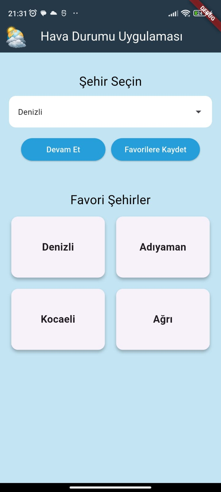
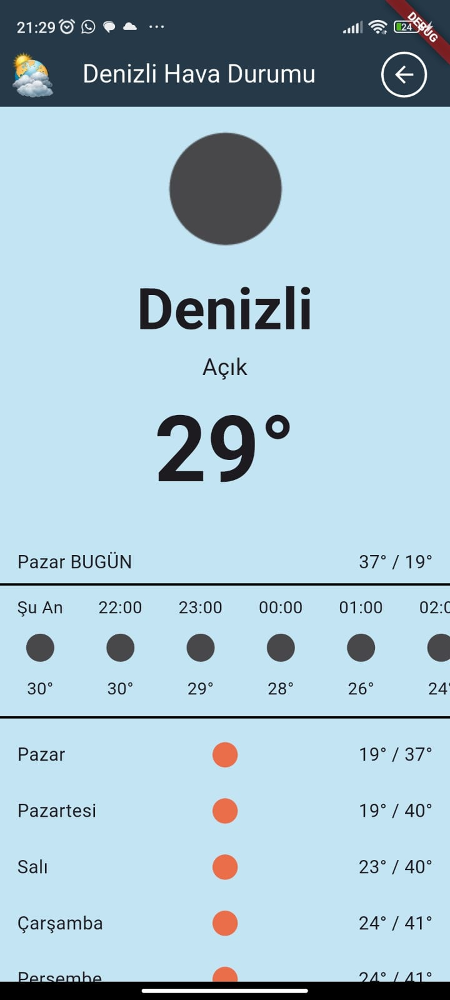

# WeatherApp
A simple weather application developed using Flutter. It features a user-friendly interface that displays weather information for cities in Turkey.

## Features
* View current weather by selecting a city

* Weather forecast for all 81 cities in Turkey

* Add and access favorite cities easily

* Clean and user-friendly UI

* Hourly and 7-day weather forecast display

## Applications Image

<table align="center">
  <tr>
    <td align="center">
       
      <b>Main Menu</b>
    </td>
        <td align="center">
       
      <b>Show Wheather</b>
    </td>
  </tr>
</table>

## Setup
1- Install the required packages:

flutter pub get

2- Run the application:

flutter run
